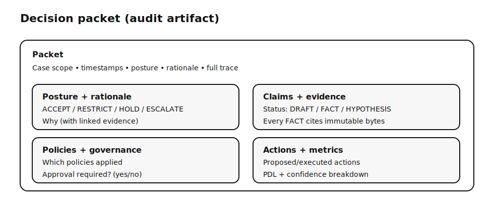
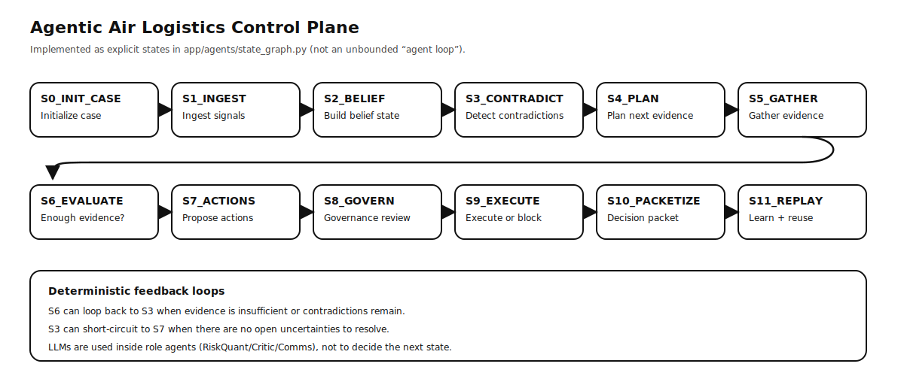
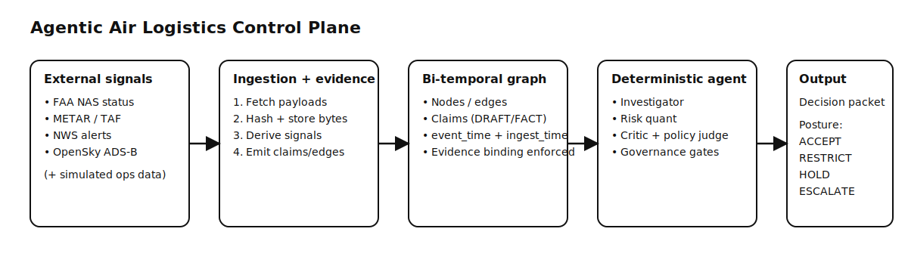
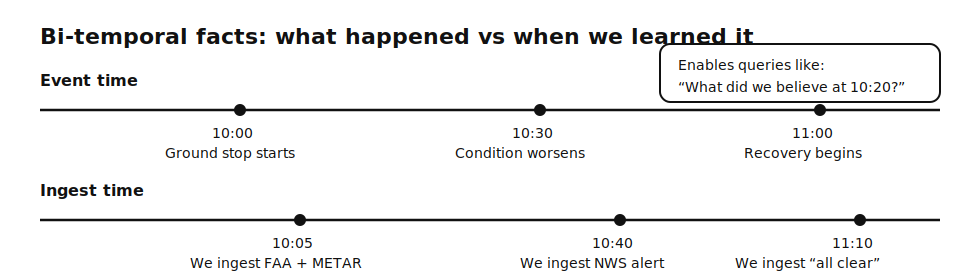

# Agentic Air Logistics Control Plane — Context Graph + Multi-Agent Orchestration for Air Freight Forwarding

Agentic Air Logistics Control Plane ingests real disruption signals (FAA NAS status, METAR/TAF, NWS alerts, OpenSky ADS‑B), stores raw payload bytes as immutable evidence, builds a bi-temporal **context graph**, and runs a deterministic **multi-agent** state machine to emit a governed **decision packet** with a gateway posture:

- `ACCEPT` — accept new bookings
- `RESTRICT` — accept with constraints (tier / SLA / lane)
- `HOLD` — pause tendering until evidence clears
- `ESCALATE` — route to a duty manager

## Why this is interesting

- **Evidence binding enforced at the DB layer**: you can’t promote a claim/edge to `FACT` without linked evidence (trigger guardrail).
- **Bi-temporal primitives + point-in-time queries**: edges/claims carry *event time* (`event_time_start/end`) and *ingest time* (`ingested_at`). The canonical predicate is in `app/graph/visibility.py`, and `POST /graph/bitemporal/beliefs` returns edges/claims/evidence visible “as-of” a given `(event_time, ingest_time)` for audit/debug.
- **Deterministic orchestration**: a state machine coordinates specialist agents (not an unbounded ReAct loop).
- **Decision packets**: posture + rationale + claims+evidence + contradictions + policies + actions + metrics (PDL) in one audit artifact.
- **Simulation + ops graph seeding**: run scenarios, seed shipments/flights/bookings, and run cascade analysis from an airport disruption.



## The pipeline (runtime + detailed decomposition)

Runtime orchestration is in `app/agents/orchestrator.py` (specialist-role state machine). The repo also includes a more granular 12-state decomposition in `app/agents/state_graph.py` (used as the “detailed pipeline” spec + belief-state modeling).



| State | What happens |
|---|---|
| `S0_INIT_CASE` | Initialize the case scope + baseline posture |
| `S1_INGEST_SIGNALS` | Ingest signals (FAA, weather, alerts, ADS‑B) into evidence store + graph |
| `S2_BUILD_BELIEF_STATE` | Build the belief state (hypotheses, uncertainties, posture) from graph |
| `S3_DETECT_CONTRADICTIONS` | Detect contradictions (e.g., FAA says ground stop but ADS‑B shows movement) |
| `S4_PLAN_NEXT_EVIDENCE` | Plan what evidence to gather next (bounded + deterministic planner) |
| `S5_GATHER_EVIDENCE` | Actually gather that evidence (HTTP clients + retries) |
| `S6_EVALUATE_POSTCONDITIONS` | Evaluate: do we have enough evidence to proceed or loop back? |
| `S7_PROPOSE_ACTIONS` | Propose actions (hold tendering, restrict bookings, notify, etc.) |
| `S8_GOVERNANCE_REVIEW` | Governance review (policy checks + approval requirements) |
| `S9_EXECUTE_OR_BLOCK` | Execute safe actions or block pending approvals/missing evidence |
| `S10_PACKETIZE_AND_PERSIST` | Build + persist the decision packet (audit trail) |
| `S11_REPLAY_AND_LEARN` | Mine/reuse playbooks for similar future cases |

Runtime (what actually runs) is the specialist-role machine:

`INIT → INVESTIGATE → QUANTIFY_RISK → CRITIQUE → EVALUATE_POLICY → PLAN_ACTIONS → (DRAFT_COMMS) → EXECUTE → COMPLETE`

## Multi-agent roles (specialists)
- **Investigator**: gathers evidence + creates initial claims/edges
- **RiskQuant**: LLM-assisted risk assessment with confidence breakdown
- **Critic**: challenges evidence quality; can force reinvestigation
- **PolicyJudge**: evaluates governance policies; can veto/propose constraints
- **Comms**: drafts notifications (internal/external)
- **Executor**: executes approved actions and records outcomes

## Tech stack

- **API**: FastAPI + Pydantic v2
- **DB**: Postgres + `pgvector` (HNSW/IVFFlat index with version-aware fallback)
- **Data access**: SQLAlchemy 2.x + psycopg2
- **Ingestion**: `httpx` + `tenacity` retries (FAA/NWS/weather/OpenSky)
- **LLM (optional)**: OpenAI SDK + Anthropic SDK behind `app/llm/client.py`
- **Dev/test**: `pytest` (+ asyncio), Docker Compose for local DB



## How data actually flows (ingestion → decision)

1. **Ingest sources** in parallel (`FAA_NAS`, `METAR`, `TAF`, `NWS_ALERTS`, `OPENSKY`).
2. **Store raw bytes** as immutable evidence (SHA‑256 addressed) + create `evidence` DB rows.
3. **Derive signals** from evidence into graph edges (e.g., disruption, weather risk, movement collapse) with evidence binding.
4. **Detect contradictions / uncertainties** and record missing evidence requests when a source fails.
5. **Run roles** (RiskQuant/Critic/PolicyJudge/Planner/Executor) under deterministic orchestration.
6. **Emit a decision packet** (posture + rationale + evidence + policies + actions + metrics).

Note: `POST /ingest/airport/{icao}` is a pre-seed/debug endpoint that writes **evidence**. A case run is what turns that evidence into **graph edges** + a **decision packet**.

## Demo paths (so the UI doesn’t look “random”)

There are **two different kinds of data** in this repo:

- **Disruption signals** (FAA/weather/alerts/ADS‑B): ingested as immutable evidence and turned into airport edges/claims.
- **Operational entities** (flights/shipments/bookings): **simulated demo data** used to show cascade impact and shipment-level governance.

The UI now exposes explicit controls:

1. **Posture-only demo (no ops graph)**: Select airport → *Ingest Signals* → *Create Case* → *Run Agent*. You’ll get posture + evidence; the cascade section may be empty.
2. **Cascade demo (ops graph)**: Select airport → *Refresh Ops Graph* → *Create Case* → *Run Agent*. The cascade section will show flights/shipments/bookings and will label the source as `SIMULATION`.
3. **Scenario demo**: `POST /simulation/run/<scenario_id>` runs a full canned scenario (and seeds ops data if missing).

The built-in ops simulation intentionally uses a small set of major airports (see `simulation/operational_data.py`) to keep the demo graph lightweight; extend it if you want a larger network.

If you want a clean slate for one airport’s operational graph: *Clear Ops Graph* (or `DELETE /simulation/seed/airport/{ICAO}`). *Refresh Ops Graph* clears existing `SIMULATION` ops data touching the selected airport before seeding so SLA times stay anchored near “now”.

## Key terms

- **Disruption**: any signal implying reduced or uncertain capacity at/around an airport (ground stop programs, severe alerts, forecast deterioration, traffic anomalies).
- **Risk**: probability-weighted impact on commitments, expressed with a source-level confidence breakdown (what succeeded / failed / is missing).
- **Evidence**: raw source payload bytes stored immutably (hash-addressed) so downstream claims cite exact bytes.
- **Claim**: a statement with status `DRAFT` / `FACT` / `HYPOTHESIS` / `RETRACTED`.
- **Bi-temporal**: every edge/claim tracks *event time* (`event_time_start/end`, best-effort from source; falls back to retrieval time) and *ingest time* (`ingested_at`, when the system learned it). The default UI flow ingests most sources “on-demand” for a run, so `ingested_at` often clusters around the run time; the point-in-time API is for audit/debug and replay across multiple ingests.
- **Resolved (missing evidence)**: when a source fetch fails, the system records a `missing_evidence_request`. When a later successful fetch arrives, it sets `resolved_at` + `resolved_by_evidence_id`. **BLOCKING** missing evidence stops the case from proceeding until resolved.
- **Decision packet**: the audit artifact output of a run.



## “Knows what it doesn’t know”

1. **Missing evidence is first-class state** (`missing_evidence_request`) instead of hand-waving uncertainty.
   - `BLOCKING` missing evidence causes the case to complete as `BLOCKED` (packet includes what’s missing and why).
   - Once evidence arrives, requests are automatically marked resolved; re-run the case to generate an updated packet.
2. **FACT requires evidence**: DB triggers reject “FACT without evidence” promotions.

## Run options

Prereqs: Python 3.11+ and Postgres with `pgvector`. This is not “Supabase vs local” — it’s **just Postgres** via `DATABASE_URL`.

### Option A: One-command setup (recommended)

This creates `.venv`, installs deps (including LLM client libs), validates DB connectivity, and runs migrations.
Re-run it after pulling updates to apply any new migrations (it’s idempotent).

```bash
cp .env.example .env
# edit .env: set DATABASE_URL (and LLM keys if running agent workflows)
./setup.sh  # or: make setup
```

Then run the server:

```bash
make run
```

Open `http://localhost:8000/ui/`.

### Option B: Local Postgres via Docker Desktop

```bash
  make up
./setup.sh   # runs migrations against DATABASE_URL
make run
```

If you don’t have Docker installed, `make up` prints a clear error and install hint.

### Option C: Hosted Postgres (Supabase / Neon)

1. Create a Postgres instance (Supabase or Neon).
2. Set `DATABASE_URL` in `.env`.
3. Run:

```bash
./setup.sh
make run
```

### Option D: Local Postgres (Homebrew)

```bash
brew install postgresql@16 pgvector
brew services start postgresql@16
createdb <your_db_name>
./setup.sh
make run
```

### Migrations via `make` (if you have `psql`)

`make migrate` runs SQL migrations using `psql` and expects `DATABASE_URL` in your shell environment:

```bash
set -a && source .env && set +a
make migrate
```

## LLM providers (optional but required for full agent runs)

Some endpoints (ingestion/graph) work without an LLM. The **case orchestration** flow uses an LLM provider.

In `.env`:

```bash
LLM_PROVIDER=openai        # or: anthropic
OPENAI_API_KEY=...         # required if LLM_PROVIDER=openai
# ANTHROPIC_API_KEY=...    # required if LLM_PROVIDER=anthropic
```

If you’re not using `./setup.sh`, install LLM deps explicitly:

```bash
pip install -e ".[dev,llm]"
```

## Minimal demo (API)

```bash
curl -X POST http://localhost:8000/ingest/airport/KJFK

curl -X POST http://localhost:8000/cases \
  -H "Content-Type: application/json" \
  -d '{"case_type":"AIRPORT_DISRUPTION","scope":{"airport":"KJFK"}}'

curl -X POST http://localhost:8000/cases/<case_id>/run
curl http://localhost:8000/packets/<case_id>
```

## Simulation (built-in demo harness)

```bash
curl http://localhost:8000/simulation/scenarios
curl -X POST http://localhost:8000/simulation/run/<scenario_id>
curl http://localhost:8000/simulation/validate
```

Operational graph seeding:

```bash
curl -X POST http://localhost:8000/simulation/seed/airport/KJFK   # refresh=true (default)
curl http://localhost:8000/simulation/graph/operational-stats
```

Cascade analysis from an airport:

```bash
curl http://localhost:8000/graph/cascade/KJFK
curl http://localhost:8000/graph/shipments-with-booking/KJFK
```

## Testing

```bash
# Fast tests (no DB)
pytest tests/test_security.py tests/test_agent_non_workflow.py -v -m "not requires_db"

# Full suite (requires a test DB)
pytest tests/ -v
```

You *can* store evidence by UUID/timestamp, but then you must build separate mechanisms for dedup, immutability guarantees, and stable byte-identities for binding.

## Repo map

- `app/ingestion/` — FAA / weather / alerts / ADS‑B clients
- `app/evidence/` — immutable evidence store + hashing + excerpt redaction
- `app/graph/` — bi-temporal graph + traversal + retrieval
- `app/agents/` — deterministic orchestrator + roles + guardrails
- `app/packets/` — decision packet builder
- `simulation/` — scenarios + operational data seeding
- `docs/DATA_SOURCES.md` — implemented sources + coverage rules


